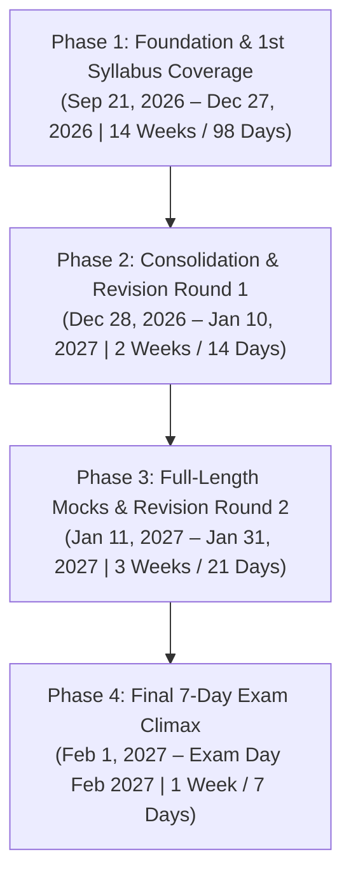
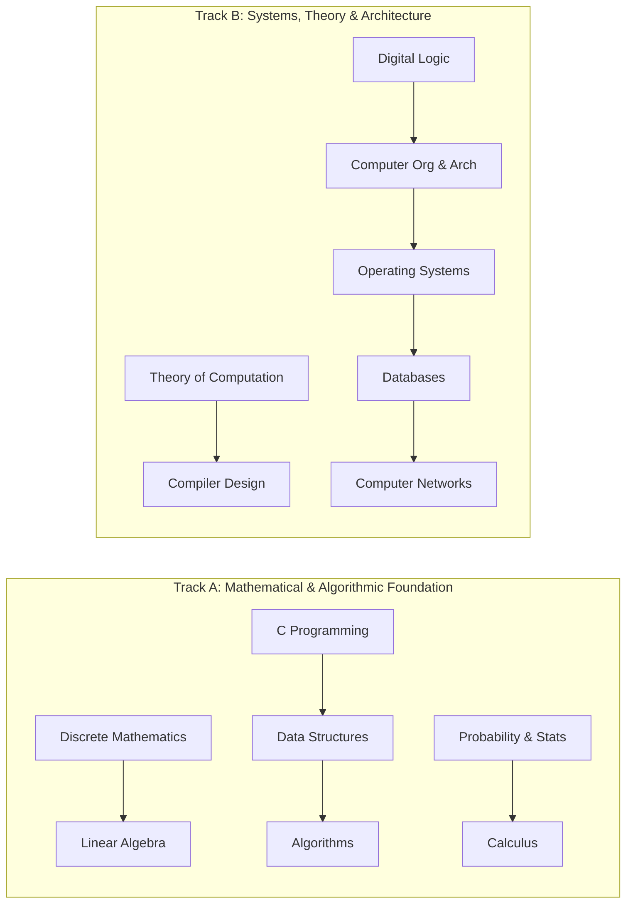
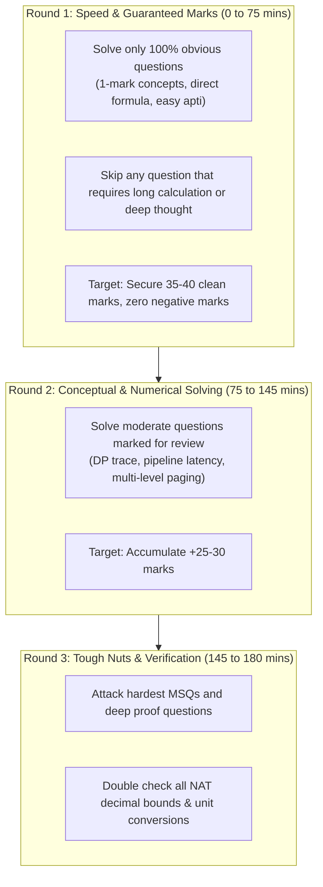

# 🚀 GATE CS 2027: THE 140-DAY MASTER ROADMAP
**Organizing Institute: IIT Madras | Syllabus: 100% Official GATE 2027 CS**  
**Start Date: 22 September 2026 | Timeline: ~139 Days (20 Weeks) | Zero-Knowledge to AIR < 100**

---

## 📑 TABLE OF CONTENTS
1. [Core Architecture & Phase Blueprint](#1-core-architecture--phase-blueprint)
2. [Syllabus Interleaving & Conceptual Dependency Matrix](#2-syllabus-interleaving--conceptual-dependency-matrix)
3. [Daily Study Routines (4h / 6h / 8h Schedules)](#3-daily-study-routines-4h--6h--8h-schedules)
4. [The Authoritative 20-Week Day-by-Day Calendar](#4-the-authoritative-20-week-day-by-day-calendar)
5. [The PYQ & Mistake Notebook Protocol](#5-the-pyq--mistake-notebook-protocol)
6. [Mock Test Execution & Analysis Protocol](#6-mock-test-execution--analysis-protocol)
7. [Strict Transition Rules & "What NOT to Do"](#7-strict-transition-rules--what-not-to-do)
8. [Phase Deadlines & Milestone Seals](#8-phase-deadlines--milestone-seals)
9. [Final 14-Day & Final 7-Day Protocol](#9-final-14-day--final-7-day-protocol)
10. [🔥 STARTING TODAY — DAY 1 ACTION PLAN](#10--starting-today--day-1-action-plan)

---

## 1. Core Architecture & Phase Blueprint

Your preparation is partitioned into 4 non-negotiable, mathematically calculated phases:



- **Phase 1 (Sep 21 – Dec 27)**: 100% Syllabus Coverage + 35 Years of GateOverflow PYQs solved topic-by-topic + Short notes creation + Topic Tests.
- **Phase 2 (Dec 28 – Jan 10)**: **Revision 1** + Re-solve Red-tag PYQs + Subject Tests & Multi-Subject Combinations.
- **Phase 3 (Jan 11 – Jan 31)**: **Revision 2** + 8 to 10 Full-Length Mock Tests in strict CBT timings (09:30 AM or 02:30 PM) + 4-Hour Post-Mortem Analysis per test.
- **Phase 4 (Feb 1 – Exam Day)**: Formula Sheets memorization + Mistake Notebook review + Zero new study + Mental peak conditioning.

---

## 2. Syllabus Interleaving & Conceptual Dependency Matrix

### Why Pure Linear Completion Fails
Studying one subject in isolation for 3 weeks leads to 80% memory decay of that subject by December. Conversely, random jumping creates confusion. We use **Dual-Track Interleaving**:



### Subject Dependency Pipeline
1. **Discrete Math & C Programming** start in parallel on **Day 1**.
2. **Data Structures** directly feeds into **Algorithms**.
3. **Digital Logic** is completed before starting **COA**.
4. **COA** hardware concepts (Registers, Memory hierarchy, Interrupts) feed directly into **Operating Systems**.
5. **Theory of Computation (Automata & Grammars)** is completed directly before **Compiler Design**.
6. **Operating Systems & Disk Architecture** feed directly into **DBMS (File Organization & Indexing)**.
7. **Calculus, Linear Algebra & Probability** are interleaved steadily across Weeks 5–10 to avoid mathematical burnout.

---

## 3. Daily Study Routines (4h / 6h / 8h Schedules)

Choose the model matching your daily availability. Maintain strict consistency.

```carousel
### 🟢 4 Hours / Day (College / Working Day Routine)
- **06:00 AM – 07:30 AM (1.5 hrs)**: **Deep Concept Study** (Primary Video Lecture / Standard Reference notes).
- **07:30 AM – 08:00 AM (0.5 hrs)**: **Daily Active Recall** (Review yesterday's short notes & formula cards).
- **07:00 PM – 08:30 PM (1.5 hrs)**: **PYQ Solving Session** (15–20 GateOverflow PYQs on the current topic without looking at solutions).
- **08:30 PM – 09:00 PM (0.5 hrs)**: **Mistake Notebook Logging** (Analyze wrong/guessed questions).
<!-- slide -->
### 🟡 6 Hours / Day (Balanced Standard Preparation Routine)
- **07:00 AM – 09:00 AM (2.0 hrs)**: **Track A: Deep Concept Study** (Discrete Math / C / DS / Algo / Engg Math).
- **09:30 AM – 10:30 AM (1.0 hr)**: **Track A PYQs** (15 GateOverflow Questions + Self-Notes summary).
- **03:00 PM – 05:00 PM (2.0 hrs)**: **Track B: Deep Concept Study** (Digital / COA / TOC / OS / DBMS / CN).
- **06:00 PM – 07:00 PM (1.0 hr)**: **Track B PYQs & Mistake Logging** + 15 mins General Aptitude Drill.
<!-- slide -->
### 🔴 8 Hours / Day (Full-Time Dedicated Aspirant / Weekend Routine)
- **07:00 AM – 09:30 AM (2.5 hrs)**: **Core Concept Lecture & In-depth Derivations (Subject 1)**.
- **10:00 AM – 11:30 AM (1.5 hrs)**: **Targeted Topic PYQ Grind (20–25 PYQs)**.
- **02:00 PM – 04:30 PM (2.5 hrs)**: **Core Concept Lecture & In-depth Derivations (Subject 2)**.
- **05:00 PM – 06:30 PM (1.5 hrs)**: **Targeted Topic PYQ Grind (20–25 PYQs)**.
- **08:30 PM – 09:30 PM (1.0 hr)**: **Daily Consolidation**: Mistake Notebook entries + 30 mins General Aptitude.
```

---

## 4. The Authoritative 20-Week Day-by-Day Calendar

### 📅 WEEKS 1 & 2: THE FOUNDATION BUILDER
**Dates: 21 September 2026 – 04 October 2026**  
**Focus: C Programming, Linear Data Structures & Discrete Math (Logic & Set Theory)**

| Day / Date | Track A (Morning) | Track B (Evening) | Daily PYQ Target | Revision & Mistake Task |
| :--- | :--- | :--- | :--- | :--- |
| **Day 1: Mon 21 Sep** | **C Prog**: Data types, Operators, Precedence, Bitwise, `printf`/`scanf` quirks | **DM**: Propositional Logic, Truth Tables, Tautology, Contradiction | 15 PYQs (C basics & Logic) | Create Mistake Notebook; write operator precedence table. |
| **Day 2: Tue 22 Sep** | **C Prog**: Control structures (`switch`, `for`, `while`), Scope, Lifetime, `static`, `extern` | **DM**: Logical Equivalences, Laws of Logic, Normal Forms (CNF, DNF) | 15 PYQs (C loops & Logic equivalence) | Flashcard review of propositional identities. |
| **Day 3: Wed 23 Sep** | **C Prog**: Functions, Parameter Passing (Call by value, simulated call by ref) | **DM**: First-Order Logic, Predicates, Quantifiers ($\forall, \exists$) | 15 PYQs (C Functions & FOL translation) | Re-solve Day 1 Red-tag errors. |
| **Day 4: Thu 24 Sep** | **C Prog**: Pointers, Pointer Arithmetic, 1D/2D Array-Pointer equivalence, `*p++` vs `(*p)++` | **DM**: Quantifier Scope, Negation, Multi-quantifier statements | 20 PYQs (Deep C Pointers & FOL) | Log pointer dereference traps in Mistake Notebook. |
| **Day 5: Fri 25 Sep** | **C Prog**: Structures, Unions, Self-referential structures, Memory padding | **DM**: Rules of Inference, Modus Ponens, Resolution principle | 15 PYQs (Structures & Inference rules) | Quick 30-min weekly formula recap. |
| **Day 6: Sat 26 Sep** | **C Prog**: Recursion (Tracing recursive call trees, Static variables in recursion) | **DM**: Sets, Operations, Venn diagrams, Cartesian products, Power sets | 20 PYQs (Hard Recursion PYQs) | Trace 5 recursion tree problems by hand. |
| **Day 7: Sun 27 Sep** | **Buffer & Weekly Consolidation**: Solve remaining Red PYQs from C & Logic | **Test**: 30-Min Topic Test (C Programming + Propositional/Predicate Logic) | 25 PYQs review | Weekly Review & Progress Tracker check-off. |
| **Day 8: Mon 28 Sep** | **DS**: 1D & 2D Arrays, Address Calculation (Row-major & Column-major mapping formulas) | **DM**: Relations, Binary Relations, Reflexive, Symmetric, Transitive closures | 15 PYQs (Array address & Relations) | Derive Row-Major and Col-Major general formulas. |
| **Day 9: Tue 29 Sep** | **DS**: Stacks (Array & Linked implementation, Push/Pop edge cases, Stack permutations) | **DM**: Equivalence Relations, Equivalence Classes, Partitions | 15 PYQs (Stack & Equivalence classes) | Memorize stack permutation Catalan number formula. |
| **Day 10: Wed 30 Sep** | **DS**: Stack Applications: Infix to Postfix conversion, Postfix evaluation, Bracket matching | **DM**: Partial Orders, POSETs, Hasse Diagrams, Maximal, Minimal, GLB, LUB | 20 PYQs (Infix/Postfix & POSETs) | Solve 10 Hasse diagram lattice verification problems. |
| **Day 11: Thu 01 Oct** | **DS**: Queues: Linear Queue, Circular Queue condition, Deque, Priority Queue basics | **DM**: Lattices, Distributive Lattices, Complemented Lattices, Boolean Lattices | 15 PYQs (Circular Queues & Lattices) | Log Circular Queue full/empty index conditions. |
| **Day 12: Fri 02 Oct** | **DS**: Singly Linked Lists: Insertion, Deletion, Reversal in $O(1)$ space, Cycle detection | **DM**: Functions: Injective (1-1), Surjective (Onto), Bijective, Inverse functions | 18 PYQs (Linked List algorithms & Functions) | Write Floyd's Cycle Detection 2-pointer proof in notes. |
| **Day 13: Sat 03 Oct** | **DS**: Doubly Linked Lists & Circular Linked Lists: Edge cases, XOR Linked List concept | **DM**: Pigeonhole Principle, Extended PHP, Basic Counting Principles | 20 PYQs (Linked Lists & PHP) | Re-solve all Week 1 & 2 Red-tagged PYQs. |
| **Day 14: Sun 04 Oct** | **Weekly Milestone Review**: Complete all pending C, DS & Discrete Math questions | **Test**: 45-Min Combined Subject Test (C + Linear DS + Set Theory/Relations/Lattices) | Complete Analysis | Update Progress Tracker; verify zero backlog. |

---

### 📅 WEEKS 3 & 4: NON-LINEAR DS, ASYMPTOTICS & ADVANCED DISCRETE MATH
**Dates: 05 October 2026 – 18 October 2026**  
**Focus: Trees, BST, Heaps, Asymptotic Complexity, Recurrences, Group Theory & Combinatorics**

- **Week 3 (Oct 05 – Oct 11)**:
  - *Data Structures*: Binary Trees (Properties, Height vs Nodes, Traversals Pre/In/Post/Level, Tree Construction from In+Pre / In+Post), Binary Search Trees (BST properties, Insertion, Deletion cases, Count of BSTs), Binary Heaps (Min/Max Heap, Array representation, `Heapify` in $O(n)$, Heap Sort, Priority Queue operations).
  - *Discrete Math*: Group Theory (Monoids, Semigroups, Groups, Abelian Groups, Subgroups, Cyclic Groups, Order of element, Lagrange's Theorem), Combinatorics (Permutations, Combinations, Binomial Coefficients, Inclusion-Exclusion Principle).
  - *PYQ Target*: 80 GateOverflow PYQs (Tree traversals, BST properties, Heap construction, Group Theory order calculation).
  - *Milestone Test (Sunday Oct 11)*: 45-Min Subject Test on Trees, BST, Heaps & Group Theory.

- **Week 4 (Oct 12 – Oct 18)**:
  - *Algorithms*: Asymptotic Notations ($O, \Omega, \Theta, o, \omega$), Mathematical definitions, Limit method of comparison, Master Theorem (all 3 cases + extended cases), Substitution Method, Recursion Tree Method.
  - *Discrete Math*: Recurrence Relations (Homogeneous & Non-homogeneous linear recurrences), Generating Functions (Closed forms, Sequence expansion), Graph Theory Foundations (Degree Sum Formula, Handshaking Lemma, Simple graphs, Paths, Cycles, Bipartite graphs, Connectivity, Components).
  - *PYQ Target*: 85 GateOverflow PYQs (Asymptotics ranking, Master theorem edge cases, Recurrence relations, Graph degree sequences).
  - *Milestone Test (Sunday Oct 18)*: **Engineering Math (Discrete Math Complete!)** + Data Structures Milestone Subject Test.

---

### 📅 WEEKS 5 & 6: ALGORITHMS, LINEAR ALGEBRA & DIGITAL LOGIC (PART 1)
**Dates: 19 October 2026 – 01 November 2026**  
**Focus: Divide & Conquer, Greedy, Dynamic Programming, Linear Algebra, Boolean Minimization**

- **Week 5 (Oct 19 – Oct 25)**:
  - *Algorithms*: Divide-and-Conquer (Binary Search, Merge Sort, Quick Sort analysis, Worst vs Best pivot, Quickselect), Greedy Algorithms (Fractional Knapsack, Huffman Coding, Activity Selection, Job Sequencing with Deadlines).
  - *Linear Algebra*: Matrices & Determinants (Properties, Trace, Invertibility), System of Linear Equations ($AX = B$, Augmented matrix, Rank method, Consistency, Unique/Infinite/No solution conditions), LU Decomposition.
  - *PYQ Target*: 80 GateOverflow PYQs (Sorting complexities, Huffman bits calculation, System of linear equations consistency).
  - *Milestone Test (Sunday Oct 25)*: Topic Test on Greedy/D&C Algorithms + Linear Algebra System of Equations.

- **Week 6 (Oct 26 – Nov 01)**:
  - *Algorithms*: Dynamic Programming (0/1 Knapsack, Longest Common Subsequence, Matrix Chain Multiplication, Subset Sum), Graph Algorithms (BFS, DFS, Cycle detection, Topological Sorting, Prim's & Kruskal's MST, Dijkstra's & Bellman-Ford Shortest Paths, Floyd-Warshall), Hashing (Chaining, Linear Probing, Quadratic Probing, Double Hashing).
  - *Linear Algebra & Digital*: Eigenvalues & Eigenvectors (Properties, Cayley-Hamilton Theorem, Diagonalization, Powers of matrix) + Digital Logic (Boolean Algebra, Laws, Canonical SOP/POS, K-Maps 2/3/4/5 variables, Essential Prime Implicants, Quine-McCluskey Tabular Method).
  - *PYQ Target*: 90 GateOverflow PYQs (DP recurrences, Dijkstra on negative weights traps, Eigenvalue trace/det properties, K-Map EPI/PI counting).
  - *Milestone Test (Sunday Nov 01)*: **Algorithms Full Subject Test** + Linear Algebra Complete Test.

---

### 📅 WEEKS 7 & 8: DIGITAL LOGIC (COMPLETE), THEORY OF COMPUTATION & CALCULUS
**Dates: 02 November 2026 – 15 November 2026**  
**Focus: Sequential Circuits, Floating Point, DFA/NFA, Regular Languages, CFGs, Calculus**

- **Week 7 (Nov 02 – Nov 08)**:
  - *Digital Logic*: Combinational Circuits (Adders, Subtractors, Ripple Carry Adder delay, Lookahead carry, MUX 2:1/4:1/8:1 tree design, Decoders, Encoders, Priority Encoders), Sequential Circuits (Latches, Flip-Flops: SR, JK, D, T, Excitation tables, Setup & Hold time, Master-Slave, Synchronous & Asynchronous Counters, Mod-N counters, State tables/diagrams), Number Systems (1's & 2's complement arithmetic, Overflow detection, IEEE 754 Single & Double Precision Floating Point).
  - *Theory of Computation*: Deterministic Finite Automata (DFA design, State Minimization, Myhill-Nerode theorem), Non-deterministic Finite Automata (NFA, $\epsilon$-NFA, Subset Construction algorithm), Regular Expressions, Regular Grammars, Arden's Theorem.
  - *PYQ Target*: 85 GateOverflow PYQs (IEEE 754 conversions, Counter design, Minimal DFA state construction).
  - *Milestone Test (Sunday Nov 08)*: **Digital Logic Full Subject Test**.

- **Week 8 (Nov 09 – Nov 15)**:
  - *Theory of Computation*: Pumping Lemma for Regular Languages, Closure Properties of Regular Languages (Homomorphism, Inverse Homomorphism, Prefix, Substring), Decision Properties of Regular Languages, Context-Free Grammars (CFG derivations, Ambiguity elimination, Left recursion elimination, CNF basics), Pushdown Automata (DPDA vs NPDA, Acceptance by final state vs empty stack, CFLs vs DCFLs), Pumping Lemma for CFLs, Closure & Decision Properties of CFLs/DCFLs.
  - *Calculus*: Limits, Continuity, Differentiability, Indeterminate forms ($0/0, \infty/\infty, 0 \cdot \infty, 1^\infty$), L'Hopital's Rule, Maxima and Minima (Single & Multivariable saddle points), Mean Value Theorems (Rolle's, Lagrange's, Cauchy's), Definite & Indefinite Integrals.
  - *PYQ Target*: 80 GateOverflow PYQs (Closure table of TOC, DPDA acceptance, Limits with series expansions, Maxima/Minima).
  - *Milestone Test (Sunday Nov 15)*: Topic Test on Automata/CFG + Calculus.

---

### 📅 WEEKS 9 & 10: TURING MACHINES, COMPILER DESIGN & PROBABILITY/STATS
**Dates: 16 November 2026 – 29 November 2026**  
**Focus: Undecidability, Lexical/Parsing, SDT, Code Optimization, Probability Distributions**

- **Week 9 (Nov 16 – Nov 22)**:
  - *Theory of Computation*: Turing Machines (Standard model, Variations, Halting Problem, Chomsky Hierarchy, Recursive vs Recursively Enumerable languages, Post Correspondence Problem (PCP), Modified PCP, Rice's Theorem Part 1 & 2, Undecidability Reductions).
  - *Compiler Design*: Lexical Analysis (Tokens, Lexemes, Buffer pairs, Regular expressions to DFA in lexing), Parsing Fundamentals (Grammar transformations, First and Follow computation, LL(1) Parsing table construction, LL(1) conflicts), LR Parsing (LR(0) items, SLR(1) parsing table, CLR(1) item sets, LALR(1) merging, Shift-Reduce and Reduce-Reduce conflicts).
  - *PYQ Target*: 85 GateOverflow PYQs (Turing decidability classification, LL(1)/LALR(1) parsing table conflicts).
  - *Milestone Test (Sunday Nov 22)*: **Theory of Computation Full Subject Test**.

- **Week 10 (Nov 23 – Nov 29)**:
  - *Compiler Design*: Syntax-Directed Translation (SDD, SDT, Synthesized vs Inherited attributes, S-attributed and L-attributed definitions, Bottom-up evaluation), Intermediate Code Generation (Three-Address Code, Quadruples, Triples, Syntax Trees, DAG representation for expressions), Runtime Environments (Activation records, Stack allocation, Scope rules), Code Optimization & Data Flow Analysis (Basic blocks, Flow graphs, Loop optimization, Constant propagation, Liveness analysis, Common sub-expression elimination).
  - *Probability & Statistics*: Axioms, Conditional Probability, Independent events, Bayes Theorem, Random Variables (Discrete & Continuous), PMF, PDF, CDF, Expectation, Variance, Standard Deviation, Covariance, Distributions (Uniform, Normal / Gaussian, Exponential, Poisson, Binomial), Descriptive statistics (Mean, Median, Mode).
  - *PYQ Target*: 90 GateOverflow PYQs (SDD evaluation, Liveness analysis iterations, Bayes theorem, Poisson/Exponential memoryless property).
  - *Milestone Test (Sunday Nov 29)*: **Compiler Design Full Subject Test** + **Engineering Mathematics Complete Grand Test**.

---

### 📅 WEEKS 11 & 12: COMPUTER ORGANIZATION & OPERATING SYSTEMS
**Dates: 30 November 2026 – 13 December 2026**  
**Focus: Pipeline Hazards, Cache Mapping, Concurrency, Virtual Memory, File Systems**

- **Week 11 (Nov 30 – Dec 06)**:
  - *COA*: Instruction Set Architecture (Instruction formats 0/1/2/3 address, Opcode expansion), Addressing Modes (Immediate, Direct, Indirect, Indexed, Base, PC-relative), RISC vs CISC, ALU Design, Booth's Multiplication, Control Unit (Hardwired vs Microprogrammed, Horizontal vs Vertical microinstructions, Control word).
  - *Operating Systems*: Process Concept, Process States, Process Control Block (PCB), Context Switching overhead, Threads (User-level vs Kernel-level, Many-to-One, One-to-One), System Calls (`fork()`, `exec()`, `wait()`, `exit()`, `pipe()`), Inter-process Communication (Shared Memory vs Message Passing), CPU Scheduling (Preemptive vs Non-preemptive: FCFS, SJF, SRTF, Round Robin, Priority, Multilevel Queue, Gantt charts, Average Turnaround & Waiting time).
  - *PYQ Target*: 90 GateOverflow PYQs (Addressing mode operand fetch calculation, `fork()` output trees, CPU scheduling calculations).
  - *Milestone Test (Sunday Dec 06)*: Combined Topic Test on ISA/ALU + Process Management/Scheduling.

- **Week 12 (Dec 07 – Dec 13)**:
  - *COA*: Memory Hierarchy & Performance, Cache Mapping Techniques (Direct Mapping, Fully Associative, K-Way Set Associative), Cache Hit/Miss latency, Effective Memory Access Time (EMAT), Write Policies (Write-Through, Write-Back, Write-Allocate, No-Write-Allocate), Multi-level Caches, I/O Interfacing (Programmed I/O, Interrupt-driven I/O, Daisy chain priority, DMA: Burst mode vs Cycle Stealing), Instruction Pipelining (Pipeline stages, Clock cycle time, Speedup, CPI, Hazards: Structural, Data RAW/WAR/WAW, Branch/Control penalty, Operand forwarding).
  - *Operating Systems*: Process Synchronization (Critical Section problem, Race conditions, Peterson's Algorithm, Hardware instructions Test-and-Set, Semaphores: Counting & Binary, Classical Problems: Producer-Consumer, Reader-Writer, Dining Philosophers), Deadlocks (4 Necessary conditions, Resource Allocation Graphs, Deadlock Prevention, Banker's Algorithm Avoidance, Detection & Recovery), Memory Management (Contiguous allocation, Paging, Page tables, TLB, Multi-level paging, Inverted paging, EMAT with TLB, Segmentation), Virtual Memory (Demand Paging, Page Faults, Page Replacement: FIFO, LRU, Optimal, Belady's Anomaly, Thrashing), File Systems & Disk Scheduling (UNIX Inode calculations, Contiguous/Linked/Indexed allocation, Disk Scheduling: FCFS, SSTF, SCAN, C-SCAN, LOOK, C-LOOK).
  - *PYQ Target*: 100 GateOverflow PYQs (Cache tag/set bits, Pipeline CPI with stalls, Multi-level page table size, Semaphore deadlock proofs, Inode direct/indirect block capacity).
  - *Milestone Test (Sunday Dec 13)*: **COA Full Subject Test** + **Operating Systems Full Subject Test**.

---

### 📅 WEEKS 13 & 14: DATABASES, COMPUTER NETWORKS & GENERAL APTITUDE
**Dates: 14 December 2026 – 27 December 2026**  
**Focus: SQL, Normalization, Transactions, B+ Trees, TCP Congestion Control, Routing, Aptitude**

- **Week 13 (Dec 14 – Dec 20)**:
  - *Databases (DBMS)*: ER Model (Entity sets, Attributes, Weak entities, Cardinality/Participation), Schema conversion, Relational Algebra (Select, Project, Cartesian product, Joins: Theta, Natural, Outer, Division operator), Tuple Relational Calculus (TRC), SQL (DDL, DML, Aggregate functions, Nested queries, Correlated subqueries, Group By, Having, Joins, Views), Functional Dependencies (Closure of attribute set, Canonical/Minimal Cover, Candidate Keys determination), Normalization Theory (1NF, 2NF, 3NF, BCNF, 4NF, Lossless Join Decomposition test, Dependency Preservation test).
  - *Computer Networks*: Layering Principles (OSI 7-Layer vs TCP/IP), Switching (Circuit Switching, Packet Switching: Datagram vs Virtual Circuit, Delays: Transmission, Propagation, Queuing, Processing, Bandwidth-Delay Product), Data Link Layer (Framing, Error Detection: Parity, Checksum, CRC generator polynomial arithmetic, Flow Control: Stop-and-Wait, Go-Back-N, Selective Repeat window sizes & efficiency, MAC: Pure/Slotted ALOHA, CSMA/CD efficiency, Minimum frame length, Backoff algorithm, Ethernet IEEE 802.3).
  - *PYQ Target*: 95 GateOverflow PYQs (Canonical cover finding, Lossless decomposition verification, Sliding window utilization, CRC remainder).
  - *Milestone Test (Sunday Dec 20)*: Topic Test on DBMS Normalization/SQL + CN Data Link Layer.

- **Week 14 (Dec 21 – Dec 27)**:
  - *Databases (DBMS)*: File Organization (Heap, Sequential, Hash files), Indexing (Primary, Secondary, Clustering, Multi-level indexing), B-Trees and B+ Trees (Order of node, Minimum/Maximum keys, Node splitting, Height calculation, Maximum records supported), Transactions & Concurrency (ACID properties, Transaction states, Schedules: Serial, Conflict Serializable via Precedence Graph, View Serializable, Recoverability: Recoverable, Cascading aborts, Strict, 2-Phase Locking: Basic 2PL, Strict 2PL, Rigorous 2PL, Conservative 2PL, Timestamp Ordering Protocol).
  - *Computer Networks*: Network Layer & Routing (IPv4 Header fields, Classful vs Classless CIDR addressing, Subnetting, Supernetting, VLSM, Fragmentation offset calculation, NAT, Routing Protocols: Distance Vector Routing & Count-to-Infinity, Link State Routing & Dijkstra), Transport Layer & Application Layer (Port numbers, UDP, TCP Header, 3-Way Handshake, TCP Flow Control, TCP Congestion Control: Slow Start, Congestion Avoidance, Fast Retransmit, Fast Recovery, Window size calculations, Socket API system calls, DNS resolution, HTTP 1.0 vs 1.1 Persistent/Non-persistent RTT calculation).
  - *General Aptitude*: Quantitative, Logical, Verbal, and Spatial Aptitude practice (Solve 2018–2026 all branch Aptitude PYQs).
  - *PYQ Target*: 100 GateOverflow PYQs (B+ tree order/height, Conflict serializability, CIDR longest prefix matching, TCP congestion window graphs).
  - *Milestone Test (Sunday Dec 27)*: **DBMS Full Subject Test** + **Computer Networks Full Subject Test**.
  - 🏆 **MILESTONE ACHIEVED: 100% FIRST SYLLABUS PASS COMPLETED ON SCHEDULE!**

---

### 📅 WEEKS 15 & 16: PHASE 2 — SYSTEMATIC REVISION ROUND 1 & SUBJECT TEST COMBO
**Dates: 28 December 2026 – 10 January 2027**  
**Focus: Re-solving All Red-Tag PYQs + Multi-Subject Combination Tests + Short Notes Polish**

```carousel
### 📘 Week 15 (Dec 28 – Jan 03): Math, Theory & Core Foundation Revision
- **Mon–Tue (Dec 28–29)**: Discrete Mathematics + Linear Algebra Revision (Solve all starred/red PYQs, review generating functions & groups).
- **Wed–Thu (Dec 30–31)**: C Programming + Data Structures + Algorithms Revision (Review master theorem, DP table patterns, AVL/Heaps).
- **Fri–Sat (Jan 01–02)**: Digital Logic + COA Revision (Review IEEE 754, Pipeline hazards, Cache set mappings).
- **Sunday (Jan 03)**: **COMBINED MULTI-SUBJECT TEST 1** (Math + DS + Algo + Digital + COA) in 3-hour simulated CBT mode + 3-Hour Analysis.
<!-- slide -->
### 📙 Week 16 (Jan 04 – Jan 10): Systems, Languages & Data Revision
- **Mon–Tue (Jan 04–05)**: Theory of Computation + Compiler Design Revision (Review Decidability table, LALR parser conflicts, SDD).
- **Wed–Thu (Jan 06–07)**: Operating Systems + Calculus & Probability Revision (Review Multilevel paging, Semaphore proofs, Distributions).
- **Fri–Sat (Jan 08–09)**: DBMS + Computer Networks + General Aptitude Revision (Review B+ trees, Serializability, CIDR, TCP windows).
- **Sunday (Jan 10)**: **COMBINED MULTI-SUBJECT TEST 2** (TOC + CD + OS + DBMS + CN + Aptitude) in 3-hour CBT mode + 3-Hour Analysis.
```

---

### 📅 WEEKS 17, 18 & 19: PHASE 3 — FULL-LENGTH MOCK MARATHON & REVISION ROUND 2
**Dates: 11 January 2027 – 31 January 2027**  
**Focus: Real Exam Simulation (10 Full-Length CBT Mocks), Negative Marking Control, 4-Hour Post-Mortem per Mock**

| Day / Date | CBT Mock Slot (09:30 AM – 12:30 PM OR 02:30 PM – 05:30 PM) | Post-Mortem Analysis & Strategy (Afternoon / Evening) |
| :--- | :--- | :--- |
| **Tue 12 Jan** | **FULL-LENGTH MOCK #01 (Previous Year GATE 2023 Paper as Mock)** | 4-Hour Post-Mortem: Categorize every negative mark into Type A/B/C/D. |
| **Fri 15 Jan** | **FULL-LENGTH MOCK #02 (Standard Test Series Mock 1)** | Analyze time spent per question; flag questions where $> 4$ mins was wasted. |
| **Sun 17 Jan** | **FULL-LENGTH MOCK #03 (Standard Test Series Mock 2)** | Review accuracy in MSQs (Multiple Select Questions) and NATs. |
| **Wed 20 Jan** | **FULL-LENGTH MOCK #04 (Previous Year GATE 2024 Paper as Mock)** | Calibrate Aptitude + Math first 45-minute speed strategy. |
| **Sat 23 Jan** | **FULL-LENGTH MOCK #05 (Standard Test Series Mock 3)** | Audit Virtual Calculator efficiency and numerical rounding mistakes. |
| **Mon 25 Jan** | **FULL-LENGTH MOCK #06 (Standard Test Series Mock 4)** | Re-solve top 50 hardest questions encountered across Mocks 1–5. |
| **Thu 28 Jan** | **FULL-LENGTH MOCK #07 (Previous Year GATE 2025 Paper as Mock)** | Test defensive question-skipping protocol (Skipping 5 hardest questions in Round 1). |
| **Sat 30 Jan** | **FULL-LENGTH MOCK #08 (Standard Test Series Mock 5)** | Final benchmark mock for target score calibration. |
| **Sun 31 Jan** | **FULL-LENGTH MOCK #09 (GATE 2026 Paper as Mock)** | Final full-length test. Lock exam pacing, time allocation, and mindframe. |

---

## 5. The PYQ & Mistake Notebook Protocol

### A. The 35-Year PYQ Target (1991–2026)
- Total GATE CS PYQs available: ~3,200 questions.
- **Priority Tier 1 (Must Solve 2–3 Times)**: 2010 to 2026 (Modern pattern, MSQs, NATs, high mathematical depth).
- **Priority Tier 2 (Solve 1 Time)**: 1991 to 2009 (Excellent conceptual drills for fundamentals).

### B. The 3-Pass Rule on Every Topic
1. **Pass 1 (Immediate Topic Solving)**: Solve all PYQs related to today's topic within 2 hours of lecture completion. Do NOT open the solution before writing your complete reasoning on rough paper.
2. **Pass 2 (Color-Coded Classification)**:
   - `🟢 Green`: Solved correctly within 2.5 minutes $\rightarrow$ Move on.
   - `🟡 Yellow`: Solved correctly but took $> 4$ mins or was hesitant $\rightarrow$ Tag for Phase 2 revision.
   - `🔴 Red`: Solved incorrectly, fell into trap, or needed solution peek $\rightarrow$ Log in [MISTAKE_NOTEBOOK_TEMPLATE.md](file:///C:/Users/rifsa/Downloads/try%20me/MISTAKE_NOTEBOOK_TEMPLATE.md).
3. **Pass 3 (72-Hour Re-Solve)**: Re-attempt Red questions on blank paper 3 days later without consulting notes.

---

## 6. Mock Test Execution & Analysis Protocol

### The 3-Round In-Exam Execution Strategy (The 180-Minute Blueprint)
During every Full-Length Mock and on the actual GATE exam day, execute strictly in 3 rounds:



### The 4-Hour Post-Mortem Protocol
Never take a mock test without spending at least 3 to 4 hours on the post-mortem:
1. **Time Breakdown**: How many minutes were spent on questions that ended up being wrong? (Goal: $< 10$ mins).
2. **Unforced Errors**: Did you misread "NOT TRUE" for "TRUE"? (Log in Mistake Notebook).
3. **NAT Checks**: Did you round off to 2 decimal places as instructed in question?
4. **Subject Health Matrix**: Track score percentage per subject across all mocks. If any subject falls below 65% accuracy, schedule a dedicated 3-hour revision block for that subject on the next day.

---

## 7. Strict Transition Rules & "What NOT to Do"

### 🚦 The Non-Negotiable Topic Transition Gate
> ⚠️ **RULE**: You are NOT permitted to move from Topic $K$ to Topic $K+1$ until:
> 1. You have watched the complete lecture/read reference for Topic $K$.
> 2. You have written a 1-page condensed Short Note for Topic $K$.
> 3. You have solved at least 80% of GateOverflow PYQs for Topic $K$.
> 4. All wrong answers have been classified and logged in your Mistake Notebook.

### 🚫 The Top 7 "Deadly Sins" in GATE Preparation
1. **❌ Collecting 10 PDF Drives & Hoarding Books**: Stick strictly to your locked resource in [RESOURCE_MASTER_GUIDE.md](file:///C:/Users/rifsa/Downloads/try%20me/RESOURCE_MASTER_GUIDE.md).
2. **❌ Passive Binge-Watching**: Watching 6 hours of videos without lifting a pen is 0% preparation. Always solve actively.
3. **❌ Making 500-Page Textbook Copies as "Notes"**: Notes must be concise derivations, trap alerts, and formula summaries.
4. **❌ Postponing Revision to January**: You will forget September topics by November if you skip the daily 30-min and weekly revision slots.
5. **❌ Solving Random Non-GATE Questions**: High-volume low-quality coaching sheets will mislead you. GateOverflow PYQs + Standard Books are the only gold standard.
6. **❌ Guessing on Negative-Mark Questions in Mocks**: Blind guessing destroys your rank. Practice disciplined skipping.
7. **❌ Fear of Mock Tests**: Waiting for "100% syllabus mastery" before taking mocks is a disaster. Start tests as scheduled in December/January regardless of perceived readiness.

---

## 8. Phase Deadlines & Milestone Seals

| Milestone # | Target Syllabus & Activity | Strict Deadline Date | Status Verification |
| :---: | :--- | :---: | :---: |
| **M1** | C Programming + Linear Data Structures + Discrete Logic & Sets | **04 October 2026** | [ ] Verified |
| **M2** | Non-Linear DS + Algorithms (Asymptotics) + Group Theory & Combinatorics | **18 October 2026** | [ ] Verified |
| **M3** | Advanced Algorithms + Linear Algebra + Digital Logic Basics | **01 November 2026** | [ ] Verified |
| **M4** | Digital Logic Complete + Theory of Computation (DFA/NFA/Reg) + Calculus | **15 November 2026** | [ ] Verified |
| **M5** | Theory of Computation Complete + Compiler Design + Probability/Stats | **29 November 2026** | [ ] Verified |
| **M6** | Computer Organization & Architecture (COA) + Operating Systems (OS) | **13 December 2026** | [ ] Verified |
| **M7** | Databases (DBMS) + Computer Networks (CN) + General Aptitude (**100% SYLLABUS PASS**) | **27 December 2026** | [ ] Verified |
| **M8** | **Phase 2: Complete Revision Round 1 + All Red PYQ Re-attempt** | **10 January 2027** | [ ] Verified |
| **M9** | **Phase 3: 10 Full-Length CBT Mocks + Revision Round 2** | **31 January 2027** | [ ] Verified |
| **M10** | **Phase 4: Final 7-Day Peak Conditioning & Master Exam Readiness** | **February 2027 (Exam Day)** | [ ] AIR < 100 Target |

---

## 9. Final 14-Day & Final 7-Day Protocol

### ⚡ Days 14 to 8 Before Exam (Late January / Early February)
- **Zero New Concepts**: Never touch any uncovered corner topic now.
- **Short Notes 3rd Pass**: Read through your condensed short notes for all 10 subjects (2 subjects per day).
- **Mistake Notebook Purge**: Re-read every single Type A, B, C, D mistake logged since September 21.
- **Formula Speed Runs**: Write down all formulas of COA (Cache/Pipeline), CN (Delays/Windows/Framing), OS (EMAT/Disk), Algo (Recurrences/Complexities), and Math (Distributions/Eigenvalues) on blank sheets from memory.

### 🧘 Final 7 Days to Exam Day
- **Day -7 to -4**:
  - Solve 15 easy questions per day from previous official papers to maintain high confidence and smooth rhythm.
  - Practice using only the official TCS-iON Virtual Calculator interface online for 20 minutes daily.
- **Day -3 to -2**:
  - Review your Personal "Anti-Trap Checklist" (e.g., "Check if graph is directed or undirected", "Check if base index is 0 or 1", "Check if time is in $\mu s$ or $ns$").
  - Synchronize circadian rhythm: Wake up at 06:30 AM, sit actively at study desk during your exact assigned exam slot (09:30 AM – 12:30 PM or 02:30 PM – 05:30 PM).
- **Day -1 (The Eve of the Exam)**:
  - Stop studying completely by 05:00 PM.
  - Pack your Admit Card, Original Government ID, transparent water bottle, and pens.
  - Eat light, hydrate, take a walk, sleep early (by 10:00 PM).
- **EXAM DAY**:
  - Reach center 90 minutes before reporting time.
  - Stay calm. You have covered 100% of the syllabus, solved 35 years of PYQs, and analyzed every mistake. Trust your preparation.

---

## 10. 🔥 STARTING TODAY — DAY 1 ACTION PLAN

**Today is Tuesday, 22 September 2026. Your journey to GATE 2027 starts right now.**

### 🎯 Day 1 Exact Schedule & Tasks

#### 🌅 Morning Session (Track A: C Programming)
- **Topic**: C Data Types, Operators, Precedence, Associativity, `printf`/`scanf` return values, Bitwise operators.
- **Locked Resource**: [Neso Academy C Programming Playlist](https://www.youtube.com/playlist?list=PLBlnK6fEyqRggZZgYpPMUxdY1CYkZtARR) (Videos 1 to 15: Introduction, Variables, Operators & Precedence).
- **Action**:
  1. Watch the videos at 1.25x or read K&R Chapter 2.
  2. Write down the **Operator Precedence & Associativity Hierarchy Table** in your clean C Programming notebook.
- **Solve Today**:
  - Open [GATE Overflow C Programming Basics](https://gateoverflow.in/questions/programming-and-ds/c-basics).
  - Solve the first 10 PYQs on C operator precedence and integer evaluation.

#### 🌆 Evening Session (Track B: Discrete Mathematics)
- **Topic**: Propositional Logic, Truth Tables, Tautology, Contradiction, Logical Connectives ($\land, \lor, \neg, \rightarrow, \leftrightarrow, \oplus$).
- **Locked Resource**: [GO Classes Discrete Mathematics by Deepak Poonia Sir](https://www.youtube.com/@GOClassesforGATECS) (Lecture 1 to 3: Introduction to Propositional Logic & Truth Tables).
- **Action**:
  1. Understand the exact conditional statement truth table (Why $F \rightarrow T$ is True).
  2. Write down the 10 basic logical equivalence laws (De Morgan's, Distributive, Absorption, Conditional-to-Disjunction).
- **Solve Today**:
  - Open [GATE Overflow Propositional Logic](https://gateoverflow.in/questions/discrete-mathematics/mathematical-logic).
  - Solve 8 PYQs on Propositional Logic truth tables and tautology testing.

#### 🌙 Night Session (Consolidation & Mistake Log)
- **Duration**: 30 Minutes.
- Open [MISTAKE_NOTEBOOK_TEMPLATE.md](file:///C:/Users/rifsa/Downloads/try%20me/MISTAKE_NOTEBOOK_TEMPLATE.md).
- Log any question you struggled with today.
- Check off "Day 1" in your [SUBJECT_WISE_SYLLABUS_TRACKER.md](file:///C:/Users/rifsa/Downloads/try%20me/SUBJECT_WISE_SYLLABUS_TRACKER.md).
- Prepare your desk for Day 2.
